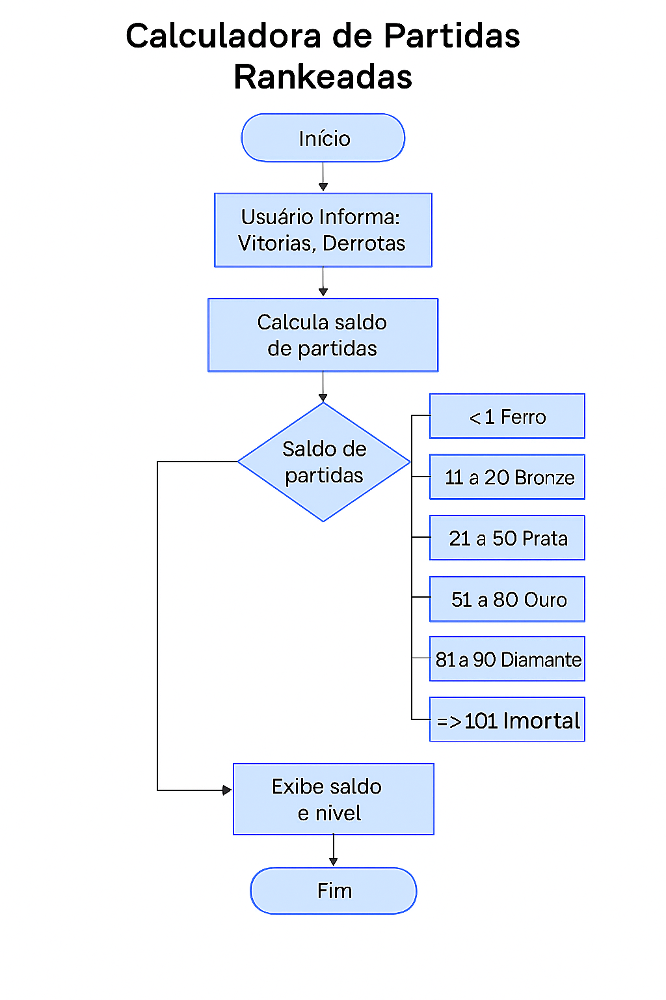

# 📊 Calculadora de Partidas Rankeadas

Projeto desenvolvido como desafio prático para consolidar os conhecimentos em **HTML**, **CSS** e **JavaScript**, utilizando boas práticas de estrutura, lógica e estilo.

---

## 🎯 Objetivo

Criar uma interface interativa onde o usuário informa a quantidade de vitórias e derrotas de um jogador e o sistema calcula:

* O **saldo de partidas rankeadas** (vitórias - derrotas)
* O **nível do jogador**, com base na seguinte classificação:

| Vitórias    | Nível    |
| ----------- | -------- |
| < 10        | Ferro    |
| 11 a 20     | Bronze   |
| 21 a 50     | Prata    |
| 51 a 80     | Ouro     |
| 81 a 90     | Diamante |
| 91 a 100    | Lendário |
| 101 ou mais | Imortal  |

---

## 🧠 Conceitos aplicados

* Declaração de variáveis com `const` e `let`
* Captura de eventos (`submit` do formulário)
* Conversão de tipos com `parseInt`
* Uso de funções puras
* Estrutura condicional (`if...else`)
* Manipulação de DOM (`document.getElementById`)
* Comentários e documentação padrão `JSDoc`

---

## 📁 Estrutura do Projeto

---

```
Classificador-Heroico
├── index.html   # arquivo principal com a estrutura da página
├── README.md
├── assets/
│   └── fluxograma.png
└── src/
    ├── style.css   # arquivo de estilo que define layout, cores e posicionamento
    └── script.js   # lógica para classificar o nível do jogador e manipular as imagens


```

---

## 💻 Funcionalidades

* ✅ Entrada de dados pelo formulário (vitórias e derrotas)
* ✅ Cálculo automático do saldo
* ✅ Determinação do nível baseado nas vitórias
* ✅ Exibição de mensagem com resultado formatado
* ✅ Interface com fundo visual atrativo (imagem + degradê)

---

---
## 🔄 Fluxograma do Projeto

Abaixo está o fluxograma que representa o funcionamento da aplicação:





---

## 🚀 Como executar localmente

1. **Clone o repositório ou baixe o `.zip`**
2. **Abra a pasta no VS Code**
3. **Abra o arquivo `index.html` no navegador**
4. **Digite os valores no formulário e clique em "Calcular"**

---

## 📦 Requisitos mínimos

* Navegador moderno (Chrome, Firefox, Edge, etc.)
* Editor de código (recomendado: VS Code)

---

## 📝 Exemplos de uso

**Entrada:**

```
Vitórias: 78
Derrotas: 23
```

**Saída:**

```
O Herói tem de saldo de 55 está no nível de Ouro
```

---


### LINK do projeto:  
👉 ## [Acesse o projeto aqui](https://jefersonmanso.github.io/Calculadora-Rankeada/)


---

## 📌 Licença

Este projeto foi desenvolvido como exercício educacional e está livre para uso não comercial.
